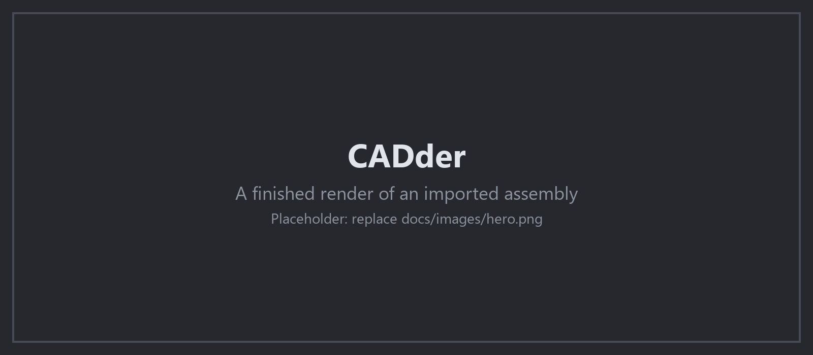
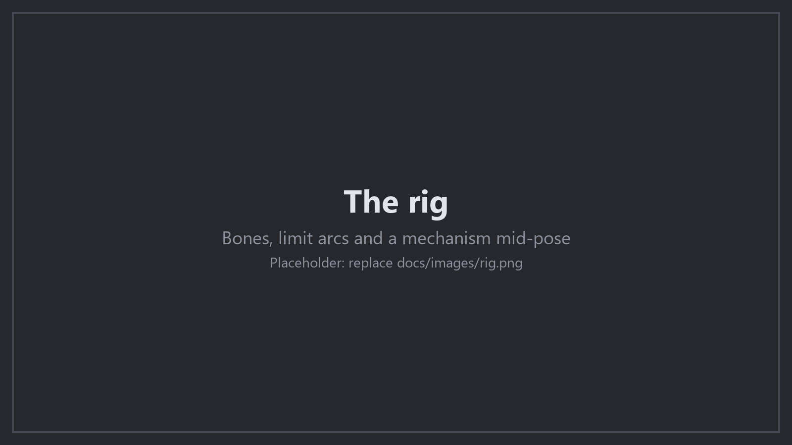
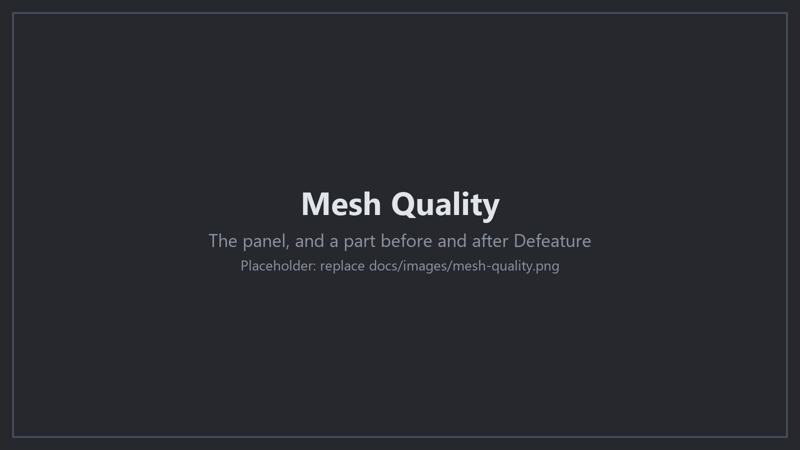
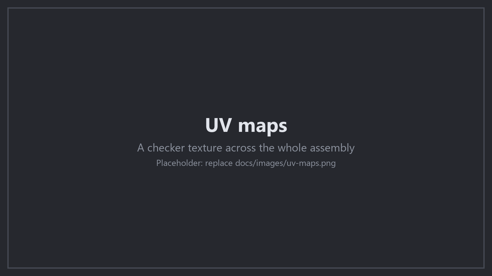

  

<h1 align="center">CADder</h1>

  <strong>CAD into Blender. Import STEP, IGES and BREP, link SolidWorks, and get a rig that moves.</strong> 
  <a href="https://github.com/Peak-Design/CADder/releases/latest">Download</a> ·
  <a href="#install">Install</a> ·
  <a href="docs/GUIDE.md">Guide</a> ·
  <a href="https://github.com/Peak-Design/CADder-SW-Bridge">CADder Bridge for SolidWorks</a> ·
  <a href="https://ko-fi.com/oskarasspalvys">Tip jar</a>

> [!NOTE]
> **STEPper NEXT is now CADder.** It outgrew the one file format it was
> named after, so it has a new name and starts again at 1.0.0. It is a
> separate install, not an update: see
> [Upgrading from STEPper NEXT](#upgrading-from-stepper-next).

## SolidWorks to Blender

<!--
  VIDEO: to put the export video here, open this file for editing on
  github.com and drag the .mp4 into the editor. GitHub uploads it and
  writes a https://github.com/user-attachments/assets/... line. Put that
  line in place of the image below, on a line of its own, and GitHub shows
  a player. Keep the file small: GitHub caps uploaded videos.
-->

<table>
  <tr>
    <td width="112" align="center">
      
    </td>
    <td>
      <strong><a href="https://github.com/Peak-Design/CADder-SW-Bridge">CADder Bridge</a></strong>
      is the SolidWorks add-in that goes with CADder. Press <strong>Send to
      Blender</strong> and the open assembly arrives in Blender with its tree,
      its appearances and a rig built from its mates. No files, no dialogs. 
      <a href="https://github.com/Peak-Design/CADder-SW-Bridge/releases/latest"><strong>Get CADder Bridge</strong></a>
    </td>
  </tr>
</table>

- **One button.** Blender starts if it is not running, and the parts land
  with their own names and the assembly tree intact.
- **A working rig.** The mates become an armature: joints, limits drawn to
  the real values, and gears, screws and cams that drive each other.
- **Stays in step with the design.** Refresh Model updates the scene part
  by part and keeps your materials, modifiers and animation.
- **Looks like SolidWorks.** Appearances, textures and decals arrive as
  Blender materials.

  

## New in 1.0.0

- **The SolidWorks Bridge**: send, refresh and rebuild from SolidWorks.
- **Rig generation** from the assembly's mates.
- **Mesh Quality**: one panel for every part, whether it came from the
  bridge or from a file, with Rebuild from CAD.
- **Defeature**: leave small holes and cutouts out of the mesh, taken out
  of the solid before it is tessellated.
- **Compound surfaces unwrapped**: faces that cannot lie flat at one
  scale go to Blender's own unwrap, so no more long thin UV ribbons.
- **Match the Blender view** to the angle of the SolidWorks view after a
  send.

The full list is in the [version history](docs/GUIDE.md#version-history).

## Features

**Import**
- STEP, IGES and BREP, read by the OpenCASCADE kernel. No conversion step.
- Smooth shading from the true surface, with sharp edges where the CAD has them.
- Quality presets in real units, background import, drag and drop.

**Mesh and UVs**
- Triangles to quads, without crossing a material, seam or sharp edge.
- UVs from the CAD surfaces: a plane, a cylinder and a cone are exact, at
  real world scale, and sheet metal unfolds to its flat pattern.
- Island packing and UDIM tiles.

**Materials**
- STEP colours and SolidWorks appearances become Blender materials.
- A material database swaps CAD material names for your own shaders on
  every import.

  
  

Everything, with the details: **[the CADder guide](docs/GUIDE.md)**.

## Install

You need **Blender 5.1**. On Windows you also need the
[Visual C++ Redistributable](https://learn.microsoft.com/en-us/cpp/windows/latest-supported-vc-redist?view=msvc-170).

1. Download the `.zip` for your platform from
   [Releases](https://github.com/Peak-Design/CADder/releases/latest).
2. Drag the `.zip` into Blender, or use **Edit > Preferences > Get
   Extensions > Install from Disk**.
3. For the SolidWorks link: tick **SolidWorks Bridge** in the CADder
   preferences, and install [CADder Bridge](https://github.com/Peak-Design/CADder-SW-Bridge)
   in SolidWorks.

The **CADder** tab is in the 3D View sidebar (N). Windows is tested.
macOS and Linux builds are made by CI but are untested.

### Upgrading from STEPper NEXT

1. Remove **STEPper NEXT** in **Edit > Preferences > Add-ons**, and
   restart Blender.
2. Install CADder as above.
3. Set your preferences again, for example the material database folder.
   Blender stores preferences by add-on name, so they do not carry over.

CADder is not on extensions.blender.org, because it ships a compiled
module that gives it its speed. It tells you in the sidebar when a new
release is out.

## Credits and license

Created by **ambi** (Tommi Hyppänen) as STEPper. Maintained by
**Peak Design** (Oskaras Spalvys).

Free and open source under the [GPL v3](LICENSE). If CADder saves you
time, a tip helps keep it going:

Found a problem? [Open an issue](https://github.com/Peak-Design/CADder/issues),
and attach the file if you can.
