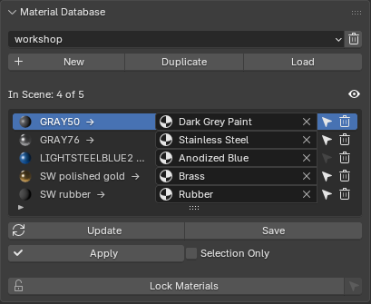
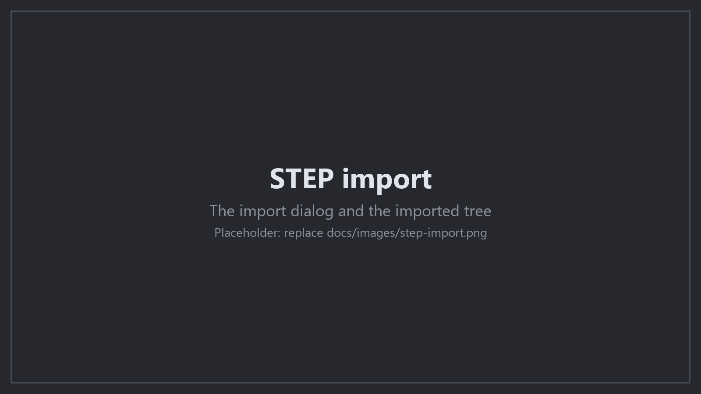

# CADder guide

The full reference for CADder. The [README](../README.md) is the short
version: what it is, how to install it, and what is new.

- [Everything it does](#everything-it-does)
- [Install details](#install-details)
- [Material Database](#material-database)
- [The live link](#the-live-link)
- [STEP import details](#step-import-details)
- [Engineering Materials](#engineering-materials-ap242--ap214)
- [UV Maps](#uv-maps)
- [Import Defaults](#import-defaults)
- [Staying Up To Date](#staying-up-to-date)
- [Version History](#version-history)
- [For Developers](#for-developers)

## Everything it does

### Live link to SolidWorks

- One button in SolidWorks sends the open assembly into a running Blender:
  geometry, appearances, the tree and the rig. No file, no dialog.
- **Refresh Model** brings the scene up to date part by part: new parts
  arrive, deleted parts go, and the parts that stayed keep their objects,
  materials and modifiers.
- **Rebuild from CAD**, from Blender, asks for the geometry again at
  another quality, or for the poses, or for the whole assembly.
- Sends only the selected components when you ask, and a multibody part as
  one object per body when you ask.
- Triangles become quads and compound surfaces are unwrapped on arrival,
  both set in the CAD add-in.
- **Match the Blender view** turns the Blender viewport to the angle the
  SolidWorks view is at.
- The listener takes connections from this machine only, with a token the
  add-in reads from your own app data.

### STEP, IGES and BREP import

- Direct import through the OpenCASCADE kernel, no conversion step.
- Analytic surface normals, so a curved face shades smoothly.
- Sharp edges marked from the CAD topology, with custom split normals.
- Quality presets in real units (0.8 mm stays 0.8 mm whatever the file is
  in), or relative tessellation that follows the size of each part.
- Damaged geometry is repaired where it can be and imported as far as it
  goes, rather than dropping the part.
- Free edges and sketches as curve objects, when you want them.
- The tree arrives as a flat collection, nested collections, parented
  empties or collection instances.
- Background import: Blender stays responsive and Esc cancels. Drag and
  drop, and a folder at a time.
- An analyzer that reads a file before you import it and estimates what it
  will cost on your machine.

### Rig generation

- The mates of the assembly become an armature: components with no freedom
  between them merge into one bone, and what is left over becomes a joint.
- Fixed, revolute, prismatic, cylindrical, ball, planar, pin slot, screw,
  path, surface and free joints.
- Mate limits become constraints, drawn to the real numbers: a dial spans
  the angle a joint may turn, a rail is as long as the travel.
- Gears, rack and pinion, screws, symmetry, cams and universal joints are
  carried as couplings, so driving one half moves the other.
- A mechanism with more than one way to drive it offers the choice, and
  rebuilds for it.
- Kinematic loops are cut by the exporter and closed again in Blender.
- Bones are sorted into what you pose, what the limits say, what follows
  and what is scaffolding.
- **Join Rigs** puts a subassembly's rig inside a machine's, on the bone
  you name, without moving anything.
- A send can keep the rig you have, bring its bones up to date while
  keeping your animation, or build a new one.

### Materials and appearances

- SolidWorks appearances arrive as Principled shaders: colour, finish,
  textures and decals, projected the way SolidWorks projects them.
- STEP colours become per face colours and materials, and the object
  colour, so a Solid viewport matches the file.
- Engineering material data (name, description, density) as custom
  properties, and as named materials when you want them.
- A material database maps CAD material names to shaders of your own, and
  applies them on every import and every send.
- **Lock Materials** keeps the materials you picked for a part through the
  database, a refresh and a rebuild.

### UV maps

- **CAD Surfaces**: one island per CAD face, straight from the surface. A
  plane, a cylinder and a cone are exact, at real world size.
- **CAD Surfaces (Smart)** joins faces that meet smoothly into one island,
  so a sheet metal part comes out as its flat pattern, and hands the faces
  no one scale can flatten to Blender's unwrap.
- Blender's own unwrap methods and a box projection, for the parts that
  want them.
- Real world UV scale, island packing with a margin, and UDIM tiles.
- Seams on closed faces, so a hole unrolls instead of smearing.
- The UV panel makes the map again for the selected parts, so one part can
  get a treatment its neighbour does not.

### Mesh quality and topology

- One **Mesh Quality** panel for both routes: the button reads the CAD
  again, whether the part came from the live link, a STEP file or an IGES
  file.
- **Triangles to Quads** pairs the tessellation back into quads without
  crossing a material, a UV island, a seam or a sharp edge.
- **Defeature** leaves the small features out of the parts you choose, set
  on a part or on a collection, by how wide a feature is and whether it
  breaks into a curved face. Nothing in the CAD document changes.
- **Clean Up Meshes** takes out the loose vertices and the zero area faces
  a tessellation can leave.
- **Lock Geometry** keeps the mesh of a part, with the changes you made to
  it, through a rebuild, a refresh and a send.
- Prune and restore the empties a STEP tree carries.

### In the scene

- Every button reads what it covers from the selection, and takes the
  collection that is active in the outliner when nothing is selected.
- What a part was imported with is stored on the part, so a rebuild or a
  refresh makes the same thing again.
- Import settings are remembered between sessions.
- Native C++ mesh extraction with threaded normals, about ten times faster
  than version 1.
- The addon says when a new version is out.

## Install details

### Working from a checkout

Keep the repository wherever the other work is, not inside the Blender
application data folder, and link it into each Blender:

```
.\tools\Link-Addon.ps1                 every installed Blender 5.1 or newer
.\tools\Link-Addon.ps1 -Version 5.2    one version
.\tools\Link-Addon.ps1 -Version 5.2 -Remove
```

The link is a directory junction, so it needs no administrator rights.
A new Blender version then needs one command and not a copy of the
repository. The script never deletes a real folder: if the addons folder
already holds a CADder directory that is not a link, it says so and
leaves it alone.

### Requirements

- **Blender 5.1** with Python 3.13
- **Windows only:** [Visual Studio C++ Redistributable](https://learn.microsoft.com/en-us/cpp/windows/latest-supported-vc-redist?view=msvc-170) (vc_redist.x64.exe)

### Platform support

| Platform | Status |
|----------|--------|
| **Windows 10+ (64-bit)** | Tested and supported |
| **macOS Apple Silicon (M1/M2/M3/M4)** | Experimental (untested) |
| **Linux (64-bit)** | Experimental (untested) |

> **Note:** macOS and Linux builds are automatically compiled via GitHub Actions but have not been tested yet. If you encounter issues on these platforms, please [open an issue](https://github.com/Peak-Design/CADder/issues).

## Material Database

A material database maps the material names a CAD import gives to
materials you made in Blender. A name can be a STEP color such as "GRAY",
an engineering material such as `AISI 304 Steel`, or a SolidWorks
appearance such as `SW polished gold`. Every STEP import and every send
from SolidWorks then puts your materials on the parts.



### Make a database

1. Import a STEP file, or send an assembly from SolidWorks. The parts
   arrive with their CAD materials.
2. Put the Blender materials you want on the parts. For example, replace
   "GRAY" with your "Stainless Steel".
3. In the **CADder** tab of the sidebar, open **Material Database** and
   click **New**. Give the database a name.
4. CADder scans the scene and records the material that replaced each CAD
   material. When one CAD material has different materials on different
   parts, the most common one wins.
5. Change an entry in the list if you want, then click **Save**.

CADder keeps each database as a `.blend` file in the material database
folder. The file holds the entries and the materials they use.

### Use a database

- **On import**: select the database in **Material DB** in the STEP import
  dialog.
- **On a send from SolidWorks**: CADder applies the database selected in
  the panel to every send, Refresh Model and finer mesh.
- **On parts already in the scene**: click **Apply**. Tick **Selection
  Only** to change only the selected parts. A selected collection instance
  includes the parts inside it.

The selected database is a preference, so it stays selected in every
file and every session.

### The list

Each row maps one CAD material name, on the left, to a Blender material,
on the right. Pick another material in the dropdown to change the entry.
The icon at the start of a row shows the material that the entry puts on
the parts.

- **In Scene** above the list counts the entries that the parts of this
  scene use. Click the eye beside it to hide the other entries, and click
  it again to show all entries.
- The arrow on a row selects the parts that have that CAD material, also
  a collection instance whose prototype has it. Shift-click adds them to
  the selection. The arrow is gray when no part of the scene has the
  material, and a hidden part is not selected.
- The trash on a row removes the entry.

A change to the list is not in the database until you click **Save**.
While the list has changes to save, the button reads **Save \***, and
**Load** asks before it discards them.

If you select another database, the list stays as it is until you click
**Load**, and a line above the list names the database it came from.
**Save** is off until then, so a list is never written into the wrong
database.

### Panel buttons

| Button | What it does |
|--------|--------------|
| **Database list** | Selects the database to use. |
| **Delete** (trash beside the list) | Deletes the file of the selected database, after it asks. |
| **New** | Makes a database from the materials in the scene. |
| **Duplicate** | Copies the selected database under a new name, for a variation of it. |
| **Load** | Shows the entries of the selected database, and adds its materials to this file. The materials stay in the file when you save it, so you can pick them for the entry of another material without a search through your libraries. |
| **Update** | Adds the CAD materials of the scene that the list does not have yet. The entries you have do not change. Click **Save** to keep them. |
| **Save** | Writes the list and its materials to the database file. A material that no entry uses any more goes out of the file. |
| **Apply** | Puts the materials of the database on the parts in the scene, or on the selected parts with **Selection Only**. |
| **Lock Materials** | Locks the materials of the selected parts. See below. |

### Lock Materials

Select parts and click **Lock Materials** at the bottom of the panel. A
locked part keeps the materials it has. These do not change them:

- **Apply**, and the database that an import or a send applies.
- **Refresh Model** and a finer mesh from SolidWorks, also when the
  appearance of the part changed in SolidWorks.
- **Send to Blender**, which replaces every part. The new part in the
  same place in the assembly is locked again and gets the materials back.
- **Regenerate**, **Rebuild Selected** and **Refresh from Disk** of a
  STEP file.

A lock keeps the materials the part has when the change starts, so a
material you pick after the lock stays too. Parts that share a mesh share
its materials, so a lock on one of them keeps the materials of all.

When every selected part is locked, the button reads **Unlock
Materials**. The arrow beside it selects the locked parts of the scene.

### Where the databases are

- By default the databases are in
  `extensions/.user/<repository>/cadder/MaterialDB/` in the Blender user
  folder. An upgrade does not delete this folder. When CADder starts, it
  moves the databases that an older version kept inside the addon folder
  to this folder.
- To share databases between computers or with a team, set **Material
  Database Folder** in the addon preferences, for example to a network
  folder.
- Each part records the original name of each material slot in its
  `STEP_materials` custom property. So a database applies correctly also
  after another database changed the materials.
- A linked material, for example from the Asset Browser, goes into the
  database as a local copy, so any `.blend` file can load it.

## The live link

The addon can receive a model straight from a CAD add-in and build a rig
from it. Today one add-in speaks to it:
[CADder Bridge](https://github.com/Peak-Design/CADder-SW-Bridge) for
SolidWorks. The link is off by default. SolidWorks runs only on Windows,
so the link is only in the Windows version. On macOS and Linux the
preferences have no **SolidWorks Bridge** option, and the sidebar shows
none of the link.

1. Open **Edit > Preferences > Add-ons > CADder**.
2. Tick **SolidWorks Bridge**. The addon starts a listener on
   127.0.0.1 and shows the port.
3. In the 3D View sidebar (N), open the **CADder** tab.

With the listener on, **Send to Blender** in the CAD add-in imports the
geometry, matches it to the rig manifest, snaps every part onto its CAD
pose, builds the armature and parents the geometry, all without a file
dialog. The listener accepts connections only from this machine, and only
with the token the add-in reads from the user's own app data.

### Which CADder Bridge works with this CADder

CADder and CADder Bridge work together when the first two numbers of their
versions are the same. The last number is a release of one of the two on
its own. It fixes or adds something that does not change what goes over
the link.

| CADder | CADder Bridge | Together |
|---|---|---|
| 1.1.0 | 1.1.3 | Yes |
| 1.1.4 | 1.1.0 | Yes |
| 1.2.0 | 1.1.3 | No. Update CADder Bridge to 1.2 |
| 1.1.2 | 1.2.0 | No. Update CADder to 1.2 |

When the two do not match, each one says so as soon as both run, before
you send anything:

- In Blender, the **CADder** tab shows **Versions do not match** under the
  name of the addon. It gives both versions, which one to update, and a
  button that opens its download page. The **Info** panel under **Rig**
  shows the same beside the port, and the System Console prints it.
- In SolidWorks, **Send to Blender** and **Refresh Model** ask before they
  send. The dialog gives both versions and a link to the download.
  **Continue** sends all the same, and SolidWorks does not ask again for
  those two versions until it closes. **Abort** sends nothing.

CADder before 1.1.1 and CADder Bridge before 1.1.1 do not check. The newer
one of the two still warns about the older one.

A send replaces the last send of the same assembly. It does not replace a
STEP import of that assembly. If the scene has one, the send stops before
it changes anything, and SolidWorks tells you. Delete the STEP import, or
open a new Blender file, and send again.

A send puts the assembly in one collection, `<assembly>_Top_Level`. In it
are two collections side by side: the assembly collection, `<assembly>`,
and the rig collection, `<assembly>_Rig`. The layout is the same for each
**Tree hierarchy** option, also **Flat collection**. So the rig is easy to
find, and one switch hides the machine and its bones together.

The next send of the same assembly uses the same `_Top_Level` collection.
You can move it into a collection of your own, and put your own objects
and collections in it. A send keeps them there. A send makes the assembly
collection again, so a collection of your own inside it moves up into
`_Top_Level`. **Refresh Model** leaves your collections where they are. It
also puts a scene from an older version in this layout: it makes the
`_Top_Level` collection and moves the rig collection next to the assembly.
When Refresh Model finds the assembly under a new document name, the
`_Top_Level` collection takes the new name too.

The **CADder** tab holds **Mesh Quality** at the top, then the link and
the panels that work on any part. Mesh Quality asks one question for both
routes: how fine the mesh is, and the button to read the CAD again. See
[Mesh Quality](#mesh-quality) below.

The line under the name of the addon says what the link is doing: the
bridge is off, waiting for a connection, or active. A second CAD
application would add a line of its own there.

**Match the Blender view**, in the CAD add-in's Export Options, turns every 3D view of Blender to the angle the CAD view is at
once the parts arrive, and frames them. The angle is the CAD
application's; the pan and the zoom are not, so Blender frames what it
holds, which is what you want to see after an import. It is off by
default, because a send should not move a view somebody is working in.

The rig is one panel with three sub-panels, two of them closed:

- **Rig**: **Join Rigs** when the scene holds more than one rig, and
  whatever the last run had to report. One dropdown per mechanism that
  offers a choice of input sits in the **Mechanism Input** sub-panel below.
  Changing the input rebuilds the rig for that choice.
- **STEP Rig**: the `.rig.json` to build from and the pipeline buttons in
  the order they run (Import STEP, Match Geometry, Snap to CAD Poses,
  Build Rig, Relink Geometry). A direct send runs all of it, so this
  panel appears only when **STEP Rig Panel** is on in the addon
  preferences.
- **Info**: the listener's port, what is selected, the joint, group and
  loop counts of the manifest, the exporter's warnings, and the match,
  pose and rig reports of the last run.

Below it come **Defeature** and **UV**, which work on any part whichever
way it came in, then **Material Database** and the STEP panels: **STEP -
Hierarchy** (Prune Hierarchy reads what the STEP importer writes, so a part
from the live link is not in it) and **STEP - File**. **STEP - Debug** joins them when **Debug Options** is on
in the addon preferences.

### Mesh Quality

How fine the mesh of a part is, whichever way the part came in. A part
from a STEP file and a part from the live link are tessellated by
different programs, but the settings are the same, and so is what they
mean. The import dialog, this panel and **Export Options** in SolidWorks
all show the same five:

| Setting | What it does |
| --- | --- |
| **Quality** | Draft (2 mm, 34°), Balanced (0.8 mm, 29°), Fine (0.2 mm, 14°), Ultra (0.05 mm, 6°), or Custom. Balanced is the default everywhere |
| **Distance** | For Custom: the largest distance between the mesh and the true surface |
| **Angle** | For Custom and Relative Tessellation: the largest angle one facet may turn through |
| **Relative Tessellation** | Cuts to a share of the size of each feature instead of a distance |
| **Relative Distance** | That share. A file import measures each edge. SolidWorks measures each body |

At the same numbers, OpenCASCADE cuts a little finer than SolidWorks: a
STEP import of an assembly has about a quarter more vertices than a send
of it.

The button says which file it is going to read again: **Rebuild from
CAD**, **Rebuild from STEP**, **Rebuild from IGES**. With parts of both
kinds in scope there is a button for each. Rebuild from CAD asks the CAD
application for the geometry again and swaps it in without losing the
pose, the materials or the rig. Press F9 after it to choose what
it brings:

| | What it asks for | What it does to the scene |
| --- | --- | --- |
| **Geometry** | The parts in scope | Swaps the meshes in |
| **Geometry and Poses** | The parts in scope | Swaps the meshes in and moves them |
| **Poses** | Where the parts sit | Moves them |
| **Refresh** | The whole assembly | Brings it up to date part by part |
| **Full Reimport** | The whole assembly | Builds it again from nothing |

The first three ask only about the parts the scene ALREADY HOLDS, so a part
added or deleted in CAD, or a mate that changed, is invisible to them. The
last two ask about the assembly itself and always take all of it, whatever
is selected.

**Refresh** is the one to reach for. A part that is still there keeps its
object, its mesh, its materials and its modifiers, and only moves and is
re-tagged. New parts arrive, deleted parts go, and the tree and the poses
follow. **Rig** says what happens to the armature: add and remove bones
(the default, which keeps an animation, because a body made of the same
parts keeps its bone name), keep it as it is, or build a new one. It is the
same work **Refresh Model** does from the CAD add-in, driven from this end.

**Full Reimport** replaces everything, so work done in Blender on those
objects goes with the old ones. Use it when the scene is wrong in a way a
refresh cannot put right.

**Triangles to Quads** pairs the tessellation triangles back into quads.
A flat or lightly curved CAD face comes out as long thin pairs that go
back together cleanly. Nothing is joined across a material, a UV island, a
seam or a sharp edge. It is on by default, and it holds for both routes:
a send, a rebuild and a regenerate all give the same mesh. The CAD add-in
sends its own answer with the geometry, which sets this one.

**Clean Up Meshes** removes the loose vertices and the zero area faces a
tessellation can leave.

The rig that is standing can be LOCKED, so a send replaces the geometry
and attaches it to the bones while the rig itself is left alone. The
button for it is not drawn: a send asks what to do with the rig it finds,
which is the same question. The operator is `cadlink.lock_rig` and it
still works from the search menu.

### Lock Geometry

Select parts and click the lock beside **Rebuild from CAD** or **Rebuild
from STEP**. A locked part keeps its mesh, with the changes you made to it
in Blender. These do not change it:

- **Rebuild from CAD** with **Geometry** or **Geometry and Poses**. The CAD
  application does not tessellate a locked part again.
- **Refresh Model**, **Refresh** and a finer mesh from SolidWorks, also
  when the part changed in SolidWorks.
- **Send to Blender** and **Full Reimport**, which replace every part. The
  new part in the same place in the assembly is locked again and gets the
  old mesh back.
- **Rebuild from STEP**, **Rebuild Selected**, **Apply Defeature**,
  **Apply UVs** in a mode that reads the CAD data, and **Refresh from
  Disk** of a STEP file.
- The **Triangles to Quads** pass and the unwrap of compound surfaces that
  run after a send.

A lock keeps the geometry and nothing else. A locked part still moves to
the pose that SolidWorks gives it, and the material database still applies
to it. Use **Lock Materials** to keep its materials too. **Clean Up
Meshes** and **Box Project** work on the mesh as it is, so they still
change a locked part.

Parts that share a mesh share its geometry, so a lock on one of them keeps
the mesh of all. The placements of a collection instance share the mesh of
the prototype in the same way.

The lock shows the state of the parts in scope: it is pressed when every
part is locked. Click it again to unlock them, and the next rebuild or
refresh gives them the geometry of the CAD data. The arrow beside it
selects the parts of the scene that have locked geometry.

### What a button covers

Every button that works on parts reads the scope from the selection, so
there is nothing to set. Parts that are selected are the parts it covers.
With no part selected it is the collection that is active in the
outliner, and every collection below it, so a whole subassembly is
treated at once without picking its parts out. The root collection is
then the whole scene. The panel says which collection it will take, so
the button reads the same way before it is pressed.

### Defeature

Which parts travel without their small features. A bolt hole costs far
more triangles than the plate it is in, and a model for a game engine
rarely wants it: the bolts are modelled and the holes are not visible.

The switch is on the PART, and on the collection above it when the
assembly came in as a tree. A part inside a collection that is set follows
the collection: its own switch is greyed, with a line saying which
collection decides. The nearest collection wins, so a subassembly can
differ from the assembly it sits in. The same settings are in the object
and collection properties, under **CAD Defeature**.

**Smaller Than** sets how wide a feature may be and still be left out,
measured across the hole it makes in the face it breaks into, so one size
covers round holes, slots, keyways and small cutouts. **Curved Faces**
takes in a feature that breaks into a face that is not flat, such as a
hole drilled into a boss. **Apply Defeature** asks for the geometry again.

The button also turns the switch on, so the switch is there to read and
to change rather than to find first. It sets the collection where the
scope came from one, and the parts themselves where it did not.

Two placements of one part are one piece of geometry in Blender: both
objects point at the same mesh, which is most of what makes a large
assembly workable. Asking for one of them defeatured and not the other
would give them two meshes, so the link decides the unit. Whatever shares
a mesh with a part in the scope is covered with it.

Where the geometry comes from depends on where the part came from, and the
switch does not. A part from the live link is asked of the CAD
application, which leaves the features out of the triangles it sends. A
part from a STEP file is read from the file again, and the features come
out of the solid itself before it is tessellated, which is exact. Nothing
in the CAD document or the STEP file is changed and no feature is written
into anybody's file.

A feature is left in unless the whole of it can be accounted for: a hole
running into a fillet, a hole breaking the silhouette, a thread. A part
that would come back with a hole in its side is sent exactly as it was.
The log says how many features went and how many were left alone.

The setting goes with every request for geometry, so Rebuild from CAD
gives back what the scene had. It also survives a rebuild of the whole
assembly, and a fresh send from the CAD application: the CAD side holds no
such setting, so a send brings the small features back, and the marked
parts are asked for again straight after.

### UV

The UV map of any part, whichever way it came in. **Box Project** reads
the mesh and nothing else. The other modes start from one island per CAD
face, so they need the CAD data: a part from a STEP file is read from the
file again, and a part from the live link is asked of the CAD application.
One UV unit is one metre of the part, whichever way the part came in, so
the texture is the same size on every part of the assembly and a 50 mm
face gets ten times the UV length of a 5 mm one. A curved face is measured
across its own surface, so a texture on a cylinder is the same size as one
on the plate beside it, and a cone is unrolled into a fan so it does not
stretch from one end to the other. A sphere, a torus and a spline cannot
be flattened at all, and there the size is the one that holds over most of
the face.

A part from the live link needs one step a part from a STEP file does not.
Its mesh carries every CAD face's points twice, once for each face that
meets there, which is what lets each point hold its own surface
coordinates. Nothing touches anything until those points are joined, so
**CAD Surfaces (Smart)** would find no neighbor to join. The addon joins
them first and marks what was a CAD face boundary sharp and as a seam. The
shape and the shading do not change: the points joined were already in the
same place, and the normals are put back as they were.

The manual route still works: export from the add-in to disk, then point
**Manifest** at the `.rig.json` and press the buttons in order. The STEP
file must sit beside the manifest, exactly as the exporter wrote the pair.

### Reading a generated rig

Bones are sorted into four bone collections, and only two of them are visible
when the rig is built:

- **`SW_controls`** (red): everything with a degree of freedom you can pose.
  Each wears a widget that says what it does: a dial with a pointer for a
  rotation, a round bar for something that slides and turns, a square bar for
  something that only slides, a helix for a screw, a ball and stud for a ball
  joint.
- **`SW_limits`** (yellow): a fixed dial or rail beside each control that has
  a limit, drawn to the real numbers: the arc spans the angle the joint may
  turn through, the rail is as long as the travel plus half a slide bar at
  each end (so the bar's end meets the rail's end when it is hard against the
  stop), the cone opens to the swing angle. The arc rings the dial it belongs
  to, so the dial's pointer reads against it.
- **`SW_mechanism`** (green, hidden): bones that move but that you do not
  drive: the driven half of a symmetry or gear coupling, the halves of a
  hydraulic ram closed by aiming, anything welded solid.
- **`SW_helpers`** (blue, hidden): scaffolding the closures need.

The widgets you take hold of are solid, and drawn from both sides so they
read from anywhere around the machine. The ones that annotate geometry (the
ball cage, the swing cone, the plane) stay wire so they do not hide what
they point at.

Switch `SW_mechanism` on in the armature's Bone Collections panel to see the
parts that follow rather than lead.

### Joining a subassembly's rig into a machine's

A machine does not have to be exported all at once. Give a subassembly its
own manifest and its own rig, move its armature into place, then:

1. select the subassembly's rig,
2. shift-select the machine's rig, so the machine is the active object,
3. **Join Rigs**, and name the bone of the machine that carries the
   subassembly (leave it empty to hang it off the machine's ground).

The subassembly's bones move into the machine's armature, its root follows
the bone you named, and its parts re-parent themselves. Nothing moves: the
button reports the largest movement it measured, and it should be zero.

The attach bone has to be at its rest pose. A bone's rest position is
absolute, so parenting under a bone that has been posed away would carry
that offset into everything joined below it. Clear the pose (Alt+G, Alt+R)
and join again. Aligning the sub-rig is a move of its ARMATURE, which is a
different thing and never in the way.

Join as many as you like. Each keeps its own joints, limits and couplings.

The rig is built inside the collection you imported into, so hiding that
collection hides the machine and its bones together. For a send from
SolidWorks, that is the `<assembly>_Top_Level` collection, and the rig
collection is next to the assembly collection. Anything the rig has no
bone for (the import's own empties, a part that did not match) is hung off
the ground bone rather than left behind, so moving the rig moves the whole
assembly. Nothing is moved between collections: everything stays exactly
where you put it.

## STEP import details



### Imported files, and refreshing them

The N-panel lists every STEP file this .blend has imported, with what it holds
and whether the file has changed on disk since. **Refresh from disk** reads the
file again and moves the new CAD data onto the objects you already have.

The objects are kept, not rebuilt. Only the mesh, the material slots and the
CAD placement change, so the work you built on top stays:

- modifiers, constraints, drivers and animation.
- the collections you put an object in, including a part ctrl-dragged into a
  second collection so it lives in two places at once.
- objects of your own that you parented to a part.
- a part you re-parented onto a rig of your own. The file decides the assembly
  structure everywhere else.
- materials you assigned yourself, and your vertex groups.
- what you hid, your custom properties and your object colors.

Placement works the same way. The importer writes down where it put each
object, so a refresh can tell a part that moved in CAD from one you moved in
Blender. A part you moved stays where you put it. A part that moved in CAD
moves. A part that moved in both does both.

A refresh never changes the size of the assembly. The settings a file was
imported with are remembered per file and stamped on the objects, so a refresh
repeats the import instead of using whatever the dialog holds at the time.

Components that have gone from the file, or are new in it, are reported rather
than guessed at. That is the signal that the assembly itself changed, and not
only its geometry.

### Import options worth knowing

- **Group in a collection**: everything a file creates goes under one
  collection named after it, so a second import does not interleave with the
  first.
- **Import curves**: free edges (sketches, construction wires) become POLY
  curve objects in a collection named "Cad Curves". They keep their place in
  the assembly and ride their parent.
- **Separate solids**: one object per body of a multibody part, for files
  that hold several solids, shells or surfaces with no assembly structure to
  tell them apart. Off by default.

## Engineering Materials (AP242 / AP214)

STEP files can carry the engineering material assigned in the source CAD system (name, description and density) alongside the geometry. Every import stores whatever it finds on each object as `STEP_material`, `STEP_material_desc` and `STEP_material_density` custom properties.

The **Engineering Materials** import option is on by default. It gives each part one Blender material named after the CAD material, such as `AISI 304 Steel`, instead of the color materials. This works with the Material Database above. Map `AISI 304 Steel` to your own steel shader once, and every later import uses it.

> **Not every CAD system writes this data.** SOLIDWORKS does not write engineering material data into STEP in any schema. Its "Export Appearances" option carries only flat per face colors, because STEP cannot hold textures or PBR properties. SOLIDWORKS also flattens the appearance overrides on components and assemblies, so every instance of a part arrives with the part color. CATIA and NX do write material data when you turn on the right export options. A file without material data imports without the custom properties.
>
> **Do you work in SOLIDWORKS?** Our free [NEXT-STEP](https://github.com/Peak-Design/NEXT-STEP-SW) add-in closes both gaps. It writes the material name and the density into the STEP file. It also keeps the color override on each instance. The geometry stays identical to the native SOLIDWORKS output.

## UV Maps

The addon creates one `UVMap` layer. The **UV Map** import option chooses what goes into it.

| Mode | Description |
|------|-------------|
| **None** | No UV layer. |
| **CAD Surfaces** | One island per CAD face, taken from the parametric surface coordinates. The fastest mode, and the default. |
| **CAD Surfaces (Smart)** | Joins CAD faces that meet smoothly into larger islands, bends a face to fit where it has to, and cuts an island where its pieces pack better. It can join across sharp edges too. A bent sheet metal part comes out as its flat pattern, a rounded tube as two islands. See below. |
| **Unwrap (Conformal)** | Blender's unwrap with packed islands. Sharp CAD edges act as seams. Keeps the angles. |
| **Unwrap (Angle Based)** | The same unwrap with the angle based method. It can fold a long cylinder on to itself. |
| **Unwrap (Minimum Stretch)** | The same unwrap with the minimum stretch method. The slowest mode. |
| **Box Project** | Triplanar projection with a world-unit tile size. |

> **Recommended settings for large models:** import with **UV Map** set to
> **CAD Surfaces** and **Pack UVs** set to **None**. CAD Surfaces takes its
> UVs from the CAD surface while the part is meshed, so it adds almost no
> time.
>
> The other UV modes and packing add a lot of time on a large model. For
> example, Smart adds about 35% and packing each part on its own adds about
> 86%. Use them on single parts: select the parts, then click **Apply UVs
> to Selected** in the **CADder: UV** panel.

The three unwrap modes are slower on large assemblies. Measured on a 182
part assembly, by share of surface area stretched more than twice as far one
way as the other: Conformal 0%, Angle Based 6%, Minimum Stretch 54%. The
Unwrap mode of 2.4 is Unwrap (Angle Based), and a file imported with it
refreshes the same way.

**Normalize UVs** is off by default. When it is off, the addon scales the UVs to real world scene units. One UV unit is then one scene unit on every island, so one shared material shows its texture at the same physical size on every part. This is what most CAD work needs.

When it is on, the addon fits the UVs to the 0-1 square. Every island of a part is divided by the same number, the largest island of that part. The islands keep their size against each other, so a 5 mm face gets a fifth of the UV length of a 25 mm face and both hold the same number of texels for each millimeter. Measured as the ratio between the densest and the sparsest island of a part: 1.0 in CAD Surfaces and in the unwrap modes.

**Closed surfaces** chooses what happens where a cylinder, cone, sphere or torus closes on itself. It applies to CAD Surfaces and the unwrap modes. CAD data marks no seam there, so an unwrap has nowhere to cut and returns a badly distorted island. None leaves it alone. Single seam, the default, cuts once, so a hole unrolls into one flat island and its two halves stay joined. Split faces cuts every boundary inside the closed region, so a hole made of two half cylinders becomes two islands.

Measured on a 182 part assembly, by share of surface stretched more than five times as far one way as the other: None 45%, Single seam 0.2%, Split faces 0.1%. Single seam reaches that with 2,958 islands against 3,381 for Split faces, so it wastes less texture on island margins. None of these change the shading.

A sheet with holes is not cut. A plate with a hole has the same topology as a length of pipe, so topology alone cannot tell them apart. The addon also walks each boundary loop and watches the surface normal. Round the end of a pipe it turns through a full circle, and that region gets its cut. Round a hole in a plate, or round the outline of a bent plate, it comes back without going round, and the region stays whole.

### CAD Surfaces (Smart)

Smart joins CAD faces that meet smoothly. A sheet metal part is a plate, a
bend and another plate. None of those boundaries is sharp, so the run is one
continuous surface that a press brake flattens into one rectangle.

Smart builds each island the way a paper model is cut out. CAD Surfaces
already gives each face a flat chart of its own. A plane chart is exact, and
a cylinder chart is the surface rolled out, circumference by height. So a
face joins the island without a solver: the addon turns its chart until the
shared edge lies on the island.

Some faces do not fit by a turn. A rounded rim is part of a torus, and its
chart misses the straight edge of a rolled out wall by a few percent. The
flat end of a tube is a ring, and it meets that edge along a circle. Smart
bends these faces instead. It measures each point of the face along the
shared edge and out from it, and sets the point down the same distance
along and out from the edge of the island. A rim becomes a strip along the
wall, and a ring unrolls into a strip. Where the edge of the island is cut,
as at the seam of a rolled out wall, the face is cut at the same place.

**Smart distortion** limits the bend, as an average over the face. The
default is 35%. Squash counts in full, because it lowers the texel density.
Stretch along the shared edge counts half, because an unrolled ring is still
a clean strip that is easy to texture. The ends of a tube 60 mm across with
a 30 mm bore score about 27%. A full disk would have to stretch without
limit at its middle, so it stays an island of its own. Set 0 to turn the
bend off.

Smart starts from the largest face of the part and tries its smooth
neighbors, largest first. A face joins only when all of these are true:

- It fits the island by a turn, or by a bend within the Smart distortion
  limit.
- It does not land on the island. A bent face must not land on itself
  either.
- The island still fits the UV tile.

A face that fails is tried again when another of its neighbors joins the
island, because that edge can fit better. A face that never fits waits for
a later island. The next island starts from the largest face that is left,
until no face is left.

**Join sharp edges** runs a second pass after the smooth one. It joins the
islands of the first pass across sharp edges, with the same tests. A join
across a fold is the same turn as a join across a smooth edge, because each
chart is flat already. A gearbox or a machined part has faces with sharp
edges all round, so without this option most of them stay islands of their
own. The option is off by default, because it adds about 25 percent to a
large import and does not always pack tighter.

Last, Smart cuts an island that has grown into an awkward shape. Every
island is a tree of faces, joined one at a time, so it can be cut along any
join, and each piece keeps its layout. A net shaped like a V, or with a long
arm out at an angle, leaves most of the rectangle round it empty. Smart
tries each join and makes the cut that makes the rectangles of the pieces
smallest, if that saves at least 10 percent. The margin the packer leaves
round each island counts too, so Smart does not cut off small pieces. Then
it tries the pieces again. **Optimize island shape** controls this cut. It
is on by default. Clear it to keep every island as large as it grew.

The tile comes from **Pack UVs**. With **None** or **Each part on its own**,
the tile is the square the part packs into by itself. With **All parts
together**, it is one tile for the whole import, so an island can grow much
longer. **Into UDIM tiles** shares the import over the tiles you ask for. A
tile is never smaller than the longest single face, because the addon never
splits a CAD face.

**Unwrap compound surfaces** gives Blender's own unwrap the faces that no
one scale can flatten. A plane, a cylinder and a cone unroll with no error at
all, and their chart carries a texture at one size all over. A sphere, a
torus and a spline do not unroll, so their chart is right over the middle of
the face and wrong at its corners. The addon measures each face against its
own texel density, and sends the faces that are off over more than 5 percent
of their area. Each one is unwrapped on its own, put back at the size of the
CAD charts of the part, and then joined like any other chart. A face keeps
the chart of its surface when the unwrap does not beat it. The option is on
by default. It costs about two seconds on a gearbox, and it is what takes
the last of the worm wheel from 96 to 100 percent of its surface inside a
factor of two.

A send from the CAD application runs the same pass over what it brings, so
a compound surface arrives ready whichever UV mode the scene is set to. The
CAD add-in carries the option as **Unwrap compound surfaces** in its Export
Options.

Smart makes its own cuts, so the **Closed surfaces** setting does not apply
to it. A turn does not change the texel density, and a bend changes it only
within the limit.

Measured results, with no island overlapping itself in any of them.
Coverage is the share of the UV tile the islands fill after Blender packs
each part into its own tile, so higher is better texel density:

| Part | CAD Surfaces | Smart | Smart, Join sharp edges |
|------|--------------|-------|-------------------------|
| Cylinder 60 mm across, both rims rounded | 5 islands, 56% | 3 islands, 57% | 3 islands, 57% |
| The same with a 30 mm bore | 6 islands, 73% | 2 islands, 79% | 2 islands, 79% |
| Plate and boss, rounded all round, with a bore | 31 islands, 58% | 3 islands, 86% | 3 islands, 86% |
| Block with rounded edges | 26 islands, 88% | 4 islands, 75% | 4 islands, 75% |
| Hydraulic part | 138 islands, 58% | 122 islands, 59% | 30 islands, 62% |
| Buoyancy module | 171 islands, 70% | 56 islands, 72% | 40 islands, 72% |
| Gear motor, 10 parts | 2,282 islands, 43% | 1,899 islands, 43% | 507 islands, 51% |
| Machined assembly, 182 parts | 440 islands, 57% | 340 islands, 57% | 151 islands, 53% |
| Sheet metal skid, 1,113 parts | 3,032 islands, 51% | 1,428 islands, 51% | 692 islands, 51% |

Small flat faces pack very tightly on their own. That is why CAD Surfaces
fills the tile best on the block with rounded edges, which is 26 plain
faces, while Smart gives four clean islands.

On the sheet metal part, Smart cuts the flat patterns at a bend. They
measure 3,338 by 977 mm, and the part packs into a 2,419 mm square on its
own. Kept whole, they would force a 3,425 mm tile and fill at most 35
percent of it. Cut, they give about twice the texel density. Set **Pack
UVs** to **All parts together** to keep them whole.

Smart adds its own pass to the import: about 35% on the sheet metal skid,
and about 40% on the machined assembly. Join sharp edges adds about 25% more
on the skid.

### Pack UVs

**Pack UVs** repacks the islands after the UV map is made. Without it the
islands keep the place the UV mode gave them, which spreads a large assembly
over many UDIM tiles and leaves most of the texture empty. Measured on 1000
parts: no packing puts the islands across 147 tiles and fills about 1 percent
of them.

| Mode | Result on 1000 parts | Cost |
|------|----------------------|------|
| **None** | 147 tiles, 1% filled | none |
| **All parts together** | 1 tile, 54% filled | +2% |
| **Into UDIM tiles** (4) | 4 tiles, 68% filled | +3% |
| **Into UDIM tiles** (16) | 16 tiles, 76% filled | +6% |
| **Each part on its own** | one tile for each part, 74% filled | +86% |

Use **All parts together** to merge the parts and texture the import as one
piece. Use **Each part on its own** to give every part its own texture: it is
the slow choice, because the packer has to run once for each part. Use **Into
UDIM tiles** for a middle way, and set how many tiles to spread the parts
over. The parts are shared out by surface area, so each tile carries a
similar amount.

The UVs are always for a square texture. Blender's own Pack Islands and
Unwrap read the image texture in the material and fit the islands to its
proportions, so on a 2 by 1 texture a square face becomes a thin rectangle.
The addon hides the materials from these operators while they run, and puts
them back after. If you pack by hand in the UV Editor, Blender still does
this on a textured part.

**Pack margin** is the space left around each island. Blender puts this
around every island, and a CAD part has about one island per face, so a whole
assembly in one tile is thousands of islands. The addon divides the margin
down as more parts share a tile. Without that correction the default margin
fills only 6 percent of the tile on a 300 part import, against 80 percent
with it. Raise the margin if a bake bleeds between islands.

**Normalize UVs** decides whether the packer may resize the islands. With
it on the islands are scaled to fill the tile. With it off the packer only
arranges them and every island keeps its real world size, so the packed
result can be larger than one tile. UDIM tiles always resize, because their
grid is fixed and an island that overruns one tile lands in the next.

Where the packer may resize, it runs Average Islands Scale first. The packer
applies one factor to the whole group, so on its own it keeps whatever size
difference the islands arrive with. Averaging first gives every island in
the group the same texel density. Box Project needs this most, because it
flattens each face onto one of three planes and a face at an angle to all
three arrives compressed.

### Tris to Quads

**Tris to Quads** is on by default. It pairs the tessellation triangles back
into quads. OCCT tessellates to triangles, so a flat CAD face arrives as thin
triangle pairs that go straight back together. It never joins across a
material, a UV island, a seam or a sharp edge.

This is not a remesh. No vertex moves and none is added or lost, and the
custom split normals from the CAD surface come through, so the shading does
not change. On 1000 parts it costs about 2 percent of the import and takes
the face count from 540,000 to 285,000.

### The UV panel

The **CADder: UV** panel in the sidebar makes the UV map of the
selected parts again. It holds the same settings as the import dialog, so
one part can get a treatment its neighbor does not. A bent bracket can be
one flat pattern while the machined block beside it stays face by face.

Box Project reads the mesh and nothing else, so it runs on the parts as they
are. The other modes need the parametric surfaces, so the addon reads the
source CAD file again and replaces the mesh, the same way **Rebuild from
STEP** does. Work you did on the mesh itself does not survive that. Transforms,
parenting, modifiers, materials and custom properties do.

The settings go on to each object. A **Rebuild** or a **Refresh from
disk** later makes the UV map you chose in the panel, not the one the import
made.

## Import Defaults

**Remember import settings** is on by default. The addon saves the import dialog options after every import and restores them in your next Blender session. Blender writes them out with its normal preferences save, so keep *Save Preferences on Quit* on. You can also save the preferences by hand. Turn the option off to use the fixed defaults in the preferences instead.

## Staying Up To Date

You install CADder from a zip and not from extensions.blender.org, because it ships precompiled binaries. Blender therefore does not update it for you. The addon asks GitHub once a day whether a newer release exists. If there is one, it shows a notice at the top of the **CADder** sidebar tab. The notice has a download link for your platform. Install the downloaded zip the same way as the first time, and Blender replaces the old version.

The check sends no information about you or your files, and runs on a background thread so it never delays startup. Turn it off with **Check for updates** in the addon preferences.

## Version History

| Version | Blender | Changes |
|---------|---------|---------|
| 1.1.1   | 5.1     | CADder and CADder Bridge say when their versions do not match, before anything is sent. Lock Materials keeps the materials of a part through the material database, Refresh Model, a send and Regenerate. Lock Geometry keeps the mesh of a part, and your changes to it, through Rebuild from CAD, Refresh Model, a send and Regenerate. The Material Database list hides the entries the scene does not use, selects the parts of an entry and removes an entry, and Load keeps the database's materials in the file. Refresh Model keeps your rig and is offered only when a running Blender holds the document. A send puts the assembly and its rig side by side in one `<assembly>_Top_Level` collection. The SolidWorks Bridge is in the Windows version only. A background import lands at the 3D cursor, and each STEP import is one undo step. Improvements and bug fixes to the automatic rig engine, Refresh Model, STEP import, Refresh from Disk, background import, Mesh Quality and the live link |
| 1.0.1   | 5.1     | Parts from SolidWorks arrive as one connected mesh, not loose faces. Empties are sized to the parts under them. A subassembly that moves as one body keeps its empties under the rig. One set of quality settings (Quality, Distance, Angle, Relative Tessellation, Relative Distance) in the import dialog, Mesh Quality and Export Options, with the same numbers on every route. Artist-Friendly Parameters and Mesh Detail are removed |
| 1.0.0   | 5.1     | The first CADder release, and the live link to SolidWorks. One button in SolidWorks sends the open assembly into the scene: geometry, appearances, the tree and a rig built from the mates. Refresh Model brings the scene up to date part by part and keeps what you did to the parts that did not change. Rebuild from CAD asks for the geometry again at another quality, for the poses, or for the whole assembly. One Mesh Quality panel now serves both routes, with Triangles to Quads, Defeature and Clean Up Meshes. CAD Surfaces (Smart) hands the faces one scale cannot flatten to Blender's own unwrap, so a compound surface no longer arrives as a long thin ribbon. Match the Blender view turns the viewport to the angle the CAD view is at. Before this release the addon was STEPper NEXT, up to 2.5.0 |
| 2.5.0   | 5.1     | The UV release. CAD Surfaces UVs now carry the proportions of the surface, so a cylinder no longer arrives as a thin tall ribbon. Patches of one surface share one island, so a drilled hole is one tube and not three. Two CAD faces no longer share one folded island. Every island of a part holds the same number of texels for each millimeter of surface. The UV Map dropdown gains CAD Surfaces (Smart), which unfolds a bent sheet metal part into its flat pattern and a rounded tube into two islands, and one mode for each unwrap method. New import options: Pack UVs with a margin and a UDIM tile count, and Tris to Quads (on by default). A new UV panel in the sidebar makes the UV map of the selected parts again, so one part can get a treatment its neighbor does not. "Split Closed Faces" becomes "Closed surfaces" with a Single seam choice, which is the new default. The sidebar tab now sits after Item, Tool and View |
| 2.4.7   | 5.1     | Imported files panel with Refresh from disk. A refresh keeps your modifiers, collections, parenting, materials and placement, and can no longer change the size of the assembly. The object color now matches the CAD color. New "Group in a collection" and "Separate solids" import options. Material databases can live in a folder of your choosing. Update notice and Ko-fi link in the sidebar. The file cache checks the file on disk, so re-exporting over the same path no longer imports old geometry |
| 2.4.6   | 5.1     | Fixed engineering materials always being created gray instead of keeping the part's imported color |
| 2.4.5   | 5.1     | Engineering material import (AP242/AP214 name, description, density) as custom properties and optional named materials. Single `UVMap` layer with a UV mode dropdown, real-world UV scaling and automatic seams on closed/cylindrical faces. Import options remembered between sessions. Parented-empties imports now leave everything at scale 1. Recursive folder batch import. Multi-file drag & drop fix |
| 2.4.4   | 5.1     | Code-review hardening: multi-level Prune/Restore, detail slider no longer overridden by the quality preset, batch import honours preference defaults, Regenerate/Reload fixed for IGES/BREP, background worker inherits preferences and cannot hang or outlive Blender, long CAD material names, edit-mode guards, tooltip and layout polish |
| 2.4.3   | 5.1     | Non-blocking background import (worker process, live progress, Esc to cancel) with a size threshold. Identical output to direct import |
| 2.4.2   | 5.1     | IGES + BREP import, sketch/construction curves import, relative (adaptive) tessellation, pre-import analyzer with import-time estimates |
| 2.4.1   | 5.1     | SurfaceUV + BoxUV layers, viewport drag & drop, folder batch import, state-preserving Regenerate, Prune/Restore hierarchy tools, mesh cleanup |
| 2.4.0   | 5.1     | Quality presets with unit-aware deflection (physical mm in any unit system), collection-instances hierarchy mode, construction-geometry filters, per-instance color overrides, modern import dialog |
| 2.3.0   | 5.1     | Migrated OpenCASCADE bindings from pythonocc-core to OCP (cadquery-ocp-novtk 7.9.3.1.1). Converted to Blender extension format with per-platform OCP wheels. Added macOS Intel support. Native mesh extraction reworked to a serialize handoff |
| 2.2.0   | 5.1     | Material database system for automatic material replacement, fixed apply-scale on instanced/multi-user meshes |
| 2.1.3   | 5.1     | Renamed to CADder, auto-apply scale, skip empty objects, preferences now persist across sessions |
| 2.1.x   | 5.1     | Multithreaded normal computation, performance optimizations, crash fixes for corrupt STEP files |
| 2.1.0   | 5.1     | Updated to pythonocc-core 7.9.3 / Python 3.13, native C++ mesh extraction |
| 2.0.0   | 5.0     | Ported to Blender 5.0 API, added import diagnostics and failed parts reporting |
| 1.1.8   | 4.2.1   | Last release by ambi |

## Support

This addon is free and open source under the GPL v3 license.

**ambi**, original creator: https://ambient.gumroad.com/l/stepper

**Peak Design**, current maintainer. Tips welcome:

[](https://ko-fi.com/oskarasspalvys)

## For Developers

The OpenCASCADE (OCP) bindings come from the [cadquery-ocp-novtk](https://pypi.org/project/cadquery-ocp-novtk/) wheels in `wheels/`, one per platform. `blender_manifest.toml` lists them, and Blender installs the matching one at extension install time. A small native mesh extraction module (`native/`) ships per platform with its own plain named OCCT subset in `native_libs/`. It talks to the importer through a BinTools serialize handoff, so it does not depend on the Python bindings. GitHub Actions builds the per platform extension zips with `.github/workflows/release.yml`. The workflow narrows the manifest to one platform and wheel per zip with `ci/make_platform_manifest.py`, then runs `ci/smoke_test.py` before it packages the addon.

The legacy addon path in `scripts/addons` still works through the retained `bl_info`. Extract the Windows wheel into the addon folder so `import OCP` resolves: `python -m zipfile -e wheels/cadquery_ocp_novtk-*-win_amd64.whl .`. The extracted `OCP/` and `cadquery_ocp_novtk.libs/` folders are gitignored.

Parity testing: `blender -b --factory-startup --python ci/parity_harness.py -- <file.step> <out.json> ['<operator_kwargs_json>']` writes a deterministic scene snapshot for diffing. The snapshot holds objects, mesh counts, materials, transforms and collections. Reference snapshots live in `ci/baselines/`, with the self contained `mat_ap242.step` and `mat_ap214.step` fixtures that test engineering material import. The other baselines point at local corpus files by absolute path. Treat those as a change detector and not as a portable test suite.

Note: on Windows the addon must not sit under a path longer than about 250 characters. The bundled OpenCASCADE DLLs fail to load if it does. The default Blender paths are fine.
